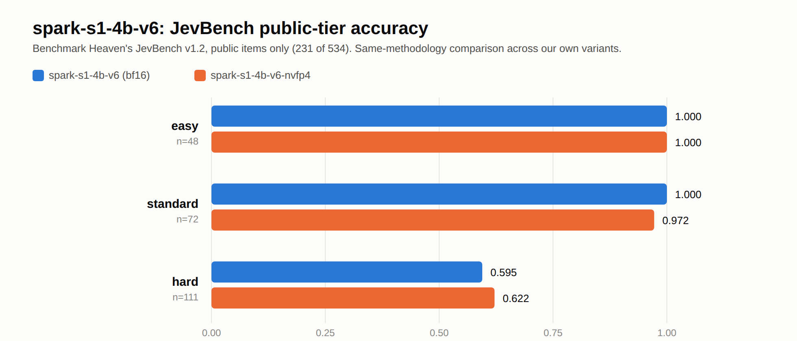
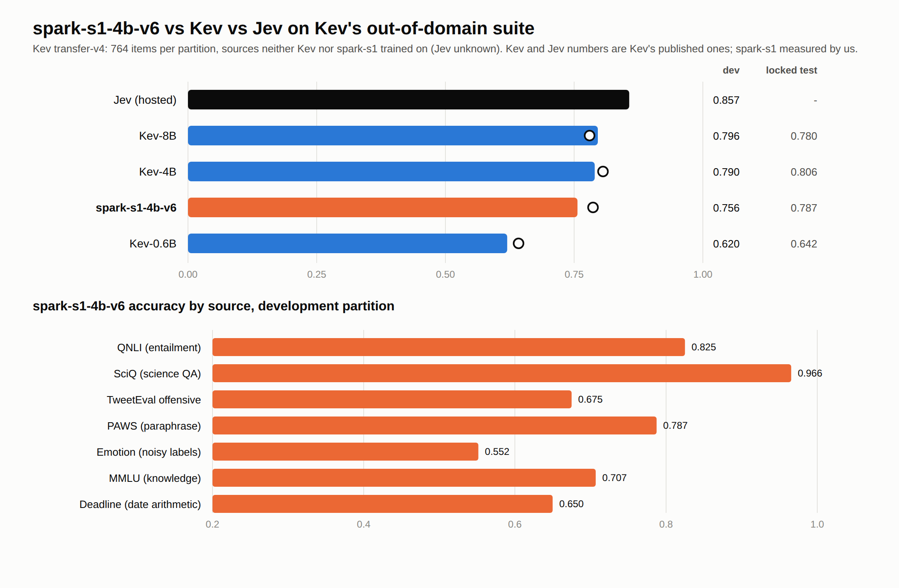
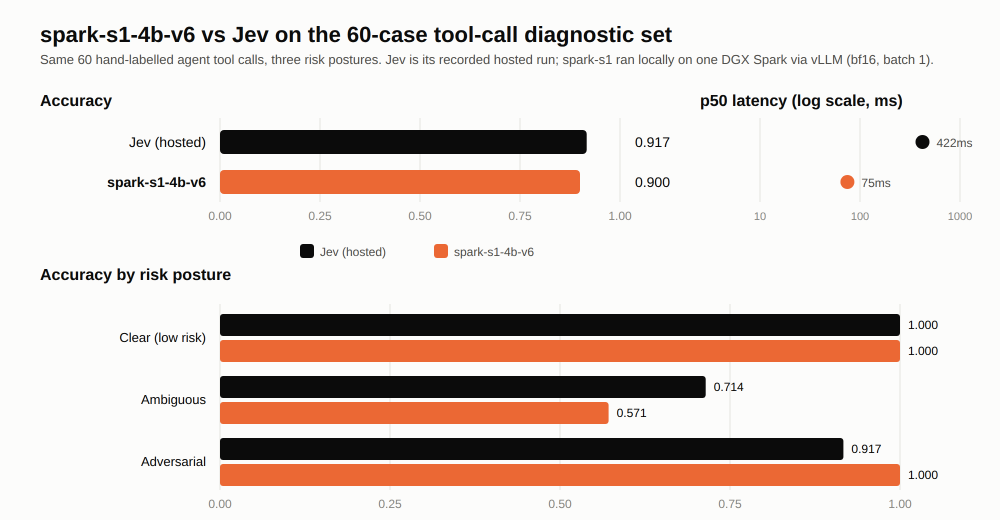

# Open Spark Jev

<p align="center">
  
  <br />
  <sub>Part of <b>Nokast</b>, an open-source AI community</sub>
</p>

<p align="center">
  <strong>An open-source, local implementation inspired by TypeSafe's Jev and System One models, built for NVIDIA DGX Spark. The model is called <code>spark-s1</code>.</strong>
</p>

<p align="center">
  <b>State in. Structured decisions out.</b>
</p>

<p align="center">
  <a href="docs/ARCHITECTURE.md"></a>
  <a href="docs/EVALUATION.md"></a>
</p>

<p align="center">
  <a href="https://huggingface.co/abhishek085/spark-s1-4b-v6"></a>
  <a href="https://huggingface.co/abhishek085/spark-s1-4b-v6-nvfp4"></a>
</p>

---

## What is Open Spark Jev?

**Open Spark Jev** is an independent, open-source implementation inspired by TypeSafe's Jev and System One, built for local inference on NVIDIA DGX Spark; it is not Jev, not a reproduction of TypeSafe's proprietary system, and not affiliated with TypeSafe. It is for decisions that need a fast, structured answer rather than generated text, such as routing, urgency, tool-call safety, or whether an agent should continue, stop or ask. The model it builds and releases is **`spark-s1`**.

Instead of asking a language model to generate an answer, you provide:

- a state
- one or more typed questions
- a set of possible decisions or criteria

The model returns **structured decisions, probabilities, and confidence**.

> **State + typed questions → structured decisions + probabilities**

The project currently supports three decision primitives:

| Primitive | What it does | Returns |
|---|---|---|
| **Choice** | Pick one option from a set | Selected option, full probability distribution, confidence |
| **Score** | Place a state on an ordered rubric or scale | Level, distribution, expected value, confidence |
| **Noul** (Boolean) | Determine whether a claim is true | Probability that the claim is true |

Several typed questions can be answered from the same state: the state is encoded once and each question adds only a short extra pass (see the [Known limitations](#current-limitations) note on this for v6's backbone specifically).

> **This is still an early-stage project.** The current release (`v6`) trains on 11,792 code/LLM-labelled decision rows across 49 Jev-style task packs — far more than the original ~1,000-row release, but still small next to Jev, and not at parity with it. It has known failure modes (see [Current Limitations](#current-limitations)); per-pack test counts are small for many of the newer packs.

---

## Current Model

One model is currently available, in two forms:

| Model | Backbone | Own held-out accuracy | JevBench Intelligence | p50 latency (vLLM) | Notes |
|---|---|---:|---:|---:|---|
| [`spark-s1-4b-v6`](https://huggingface.co/abhishek085/spark-s1-4b-v6) | Qwen3.5-4B + LoRA | **0.929** | **83.1** | **74.9 ms** (bf16) | Current best accuracy |
| [`spark-s1-4b-v6-nvfp4`](https://huggingface.co/abhishek085/spark-s1-4b-v6-nvfp4) | Qwen3.5-4B + LoRA | 0.929* | 83.2 | **53.3 ms** (NVFP4) | 1.40x faster, no measurable accuracy cost |

<sub>*NVFP4 own-splits accuracy is not independently re-measured; JevBench shows no measurable cost from quantization, so this is a reasonable prior, not a direct measurement — see [MODEL_CARD.md](MODEL_CARD.md).</sub>

v6 keeps v5's scope, data and recipe unchanged and swaps the backbone to **Qwen3.5-4B**, a hybrid architecture (24 Gated-DeltaNet linear-attention
layers + 8 full-attention layers, of 32 total) rather than a uniform transformer — the largest accuracy jump of any release so far. It is a 4B-only
release this round. Training data: **11,792 code/LLM-labelled decision rows** across **49 task packs** from the project's decision-data factory
(`os-datagen`), reshuffled into **19,568 training examples** with randomized option ordering. The models use a restricted first-token readout
rather than generating a text response.

> This is an early release candidate. Performance varies substantially across task families, and the project is under active development. Model details, limitations and pinned revisions: [MODEL_CARD.md](MODEL_CARD.md).

---

## Quickstart

Download a model and run it as a local API in one command:

```bash
git clone https://github.com/abhishek085/open-spark-jev.git && cd open-spark-jev
python3 -m venv .venv && . .venv/bin/activate
pip install torch -e ".[infer]"
osj serve --pull spark-s1-4b-v6        # downloads from Hugging Face once, then serves http://127.0.0.1:8400
```

In another terminal, ask it about a tool call (nothing is ever executed; the command is just text):

```bash
curl -s localhost:8400/v1/gate -H 'content-type: application/json' \
  -d '{"state": {"tool": "bash", "command": "kubectl get pods -n production"}}'
```

```json
{
  "choice": "allow",
  "probabilities": {"allow": 0.9998, "ask": 0.0001, "deny": 0.00004},
  "confidence": 0.9998,
  "policy_action": "allow",
  "policy_trace": ["Model: allow (1.000); P(allow)=1.000, threshold 0.995",
                   "Final policy action: allow"],
  "latency_ms": 119.4
}
```

*(Example output from a real run of `spark-s1-4b-v6`, trimmed; latency above is HF Transformers in-process, single request — see [Current Limitations](#current-limitations) and [MODEL_CARD.md](MODEL_CARD.md#latency-methodology) for why vLLM is faster and recommended for production.)* `policy_action` is what your agent should do. The default threshold is strict: `allow` needs 99.5% confidence, otherwise the agent asks a human. Lower it per request with `"policy": {"auto_allow_threshold": 0.9}`.

From Python, without a server:

```python
from open_spark_jev import classify_tool_call

r = classify_tool_call(tool="bash", command="kubectl get pods -n production", model="checkpoints/spark-s1-4b-v6")
print(r.policy_action, r.probabilities)
```

A GPU is needed for the speeds above (tested on an NVIDIA DGX Spark; other GPUs should work but are untested). More: [docs/API.md](docs/API.md).

### Typed questions over any state

The general interface takes a state and any mix of Choice, Score and Noul questions:

```python
from open_spark_jev.model import MenuScorer
from open_spark_jev.schema import Choice, Noul, Score, State

model = MenuScorer("checkpoints/spark-s1-4b-v6")

state = State(
    content={"ticket": "Charged twice for my Pro plan, invoice PDF missing."},
    schema_hint="support ticket",
)

answers = model.decide(
    state,
    [
        Choice(prompt="Which support queue?", options=["billing", "technical", "account", "sales", "abuse"], allow_abstain=True),
        Score(prompt="How urgent?", levels=["low", "medium", "high", "critical"]),
        Noul(prompt="The customer was charged more than once."),
    ],
)
```

Each answer carries a full probability distribution: for example a Choice over the queues, a Score over the urgency levels, and P(true) for the claim. The important part is that the model returns structured decisions and probabilities, not a natural-language response.

---

## Try It

Two local pages share the same server:

```bash
pip install -e ".[serve]" && osj lab        # Decision Lab: http://127.0.0.1:8400/lab (no model download needed)
scripts/run_ui.sh                            # playground for general typed questions: http://127.0.0.1:8400
```

<p align="center"></p>

The **Decision Lab** is a demo page for tool-call decisions: pick a sample command or type your own, and see the model's probabilities next to the deterministic safety rules that can override them. Without a model it uses recorded outputs, clearly labelled.

The **playground** has example tasks for support triage, retrieval routing, SQL safety, prompt-injection checks, tool-call risk, email triage, RAG sufficiency, incident routing, CI failure triage and form completion, plus confidence gating, side-by-side model comparison and API inspection. See [docs/UI.md](docs/UI.md).

---

## How It Works

Open Spark Jev uses the language model's own vocabulary distribution as a structured decision mechanism.

**1. Encode the state.** The state is rendered once and passed through the model.

**2. Turn the question into a menu.** A question is rendered as a set of options:

```text
A. billing
B. technical
C. account
D. sales
E. abuse
```

**3. Restrict the possible answers.** Instead of letting the model generate arbitrary text, the logits of the next token are restricted to the option labels (`A`, `B`, `C`, ...) and converted into a probability distribution.

**4. Calibrate.** A temperature is fitted on a separate calibration split. The result is the selected option, the probability distribution, the confidence, margin, entropy and latency. Instead of a generated sentence such as "I think this is probably a billing issue", the system returns something like:

```json
{
  "answer": "billing",
  "probabilities": {"billing": 0.91, "technical": 0.04, "account": 0.03, "sales": 0.01, "abuse": 0.01},
  "confidence": 0.91
}
```

Structured output constrains the *form* of the answer; it does not guarantee that the underlying decision is correct.

```text
                    ┌──────────────────┐
                    │      STATE       │
                    │ text / JSON /    │
                    │ logs / traces    │
                    └────────┬─────────┘
                             │
                        encoded once
                             │
                    ┌────────▼──────────┐
                    │ Qwen3.5 backbone   │
                    │ (hybrid: linear +  │
                    │  full attention)   │
                    └────────┬──────────┘
                             │
             ┌───────────────┼────────────────┐
             │               │                │
          Choice           Score            Noul
             │               │                │
             ▼               ▼                ▼
        probabilities   probabilities     P(true)
```

This makes the approach useful for systems that need several decisions about the same piece of state — though see [Known limitations](#current-limitations) for a v6-specific caveat on the "encoded once" step. How it compares with Jev and with a prompted small model: [docs/ARCHITECTURE.md](docs/ARCHITECTURE.md).

---

## Evaluation

The project evaluates the model using internal benchmarks and external decision suites. Every result is reported per source and never pooled into one score.

**Internal:** accuracy, macro-F1, Brier score, negative log-likelihood, expected calibration error (ECE), option-order sensitivity, prompt-injection flip rate, latency and throughput.

**External:** eight suites (Jev Directory, agent tool-call risk, prompt injection with and without deployment context, vulnerable code, Kev decision-v1, and Kev transfer-v4's development and locked-test partitions), each with provenance covering its upstream source, commit, license, labels and caveats. See `data/external/`, [docs/BENCHMARKS.md](docs/BENCHMARKS.md), [docs/RUNS.md](docs/RUNS.md) and the evaluation protocol in [docs/EVALUATION.md](docs/EVALUATION.md).

### JevBench (public tiers)

[Benchmark Heaven's JevBench](https://github.com/fstandhartinger/jevbench) is a third-party benchmark for Jev-class decision models (state + a
bounded rubric in, a typed answer out), scored across easy/standard/judge/hard tiers. Only 231 of its 534 v1.2 items are public (the judge tier —
28% of the official score — is entirely private, and part of every other tier is held out), so what's below is accuracy on the public items only,
not the official JevBench Score, which also needs the private item set plus Calibration, Speed and Cost axes measured under JevBench's own
protocol. It is a same-methodology comparison point between our own bf16 and NVFP4 variants, not a leaderboard placement.

<p align="center"></p>

| Model | easy (48) | standard (72) | hard (111) | Public-proxy Intelligence |
|---|---:|---:|---:|---:|
| `spark-s1-4b-v6` (bf16) | 1.000 | 1.000 | 0.595 | 83.1 |
| `spark-s1-4b-v6-nvfp4` | 1.000 | 0.972 | 0.622 | 83.2 |

### Independent evaluation: Kev's out-of-domain suite

Neither `spark-s1` nor Kev trained on these sources, and the suite was built by someone else, so it checks the model on data we did not write. Kev and Jev numbers are Kev's published ones; `spark-s1` was measured by us on the same 764 items per partition. `spark-s1-4b-v6` scores 0.787 on the locked test (Kev-4B 0.806, Kev-8B 0.780) and 0.756 on the development partition (Kev-4B 0.790, Kev-8B 0.796, Jev 0.857): behind Kev-4B/8B and Jev, ahead of Kev-0.6B, with far less training data than any of them.

<p align="center"></p>

### Diagnostic set: 60 tool calls, directly against Jev

<p align="center"></p>

| System | Diagnostic-set accuracy | p50 latency | Decisions/s | Notes |
|---|---:|---:|---:|---|
| Recorded hosted Jev reference | 0.917 | 421.6 ms | 2.3 | Hosted measurement; includes network/service overhead |
| `spark-s1-4b-v6` (Qwen3.5-4B, LoRA) | 0.900 | 74.9 ms | 13.3 | Local, one DGX Spark, vLLM bf16, batch 1 |

> The 60-case set is a diagnostic benchmark used during development, not a locked final holdout, and it is small (about ±5 points). Results should not be read as broad Jev parity or a pure local-model-speed comparison: the hosted Jev timing includes a network round trip. These numbers are an early-release snapshot, not a general measure of model capability.

---

## Current Limitations

This is an early release, narrowed on purpose to Jev-style decisions. Known gaps as of v6:

- General-purpose text classification and vulnerable-code detection are **out of scope for this release** — untested, not merely weak (earlier releases measured vulnerable-code detection near chance, about 0.56)
- **HF Transformers in-process serving and training are slow on this backbone.** `causal_conv1d` and `flash-linear-attention` are not installed, so the linear-attention layers fall back to unoptimized reference kernels (training ran ~31-34s/step vs the prior backbone's ~18s/step, despite fewer O(n²) attention layers). **vLLM is unaffected** — it has its own fast native kernels for this architecture and is the recommended serving path; the latency and JevBench numbers above use it
- **The state-cache optimization (encode the state once, answer several questions cheaply) does not apply to this backbone yet** — it falls back to a full forward pass per question; results are correct, just without the multi-question speedup the architecture section above describes
- **The backbone swap is not a clean win**: two of five external Jev-style sets regressed slightly versus the prior release (prompt-injection-without-context, and the 60-case tool-call set), even as own-splits and JevBench improved substantially — see [MODEL_CARD.md](MODEL_CARD.md) for the full comparison
- RLCD (outcome-based calibration) made results **worse**, not better, in two separate attempts on earlier releases and is not applied to any released checkpoint
- Per-pack test counts are small for many of the 49 task packs; read per-pack numbers as noisy
- Sensitive to how options are defined and to option order; recalibrate on your own labelled outcomes before relying on thresholds
- Commands that weaken security settings, copy credentials out, or hide a cloud copy as a "backup"

The project should not be treated as a production-ready decision engine for high-stakes applications.

> [!WARNING]
> Never use a model decision as the only control before running a tool. Keep permission checks, least-privilege credentials, logging and human approval for sensitive actions. Anything low-confidence or unrecognised should go to a human, not run. The built-in rules (`open_spark_jev/policy.py`) are simple and incomplete: they block obvious cases, such as sending a secrets file over the network, and the model can never override them. See [SECURITY.md](SECURITY.md).

---

## Training

The training pipeline is included in the repository.

**Phase 1: supervised fine-tuning** (`open_spark_jev/train/sft.py`). Multi-task decision examples with soft targets, cross-entropy plus a Brier regulariser, and per-type temperature fitting. The pipeline can use simulator-generated data, public datasets, teacher-generated data and the code-labelled `os-datagen` data. **The released model used only the `os-datagen` rows**, including code-only rule packs where both the label and the surface text come from deterministic rules, no LLM in the loop. LoRA (r=16, alpha 32) adapts all attention and MLP projections — extended for v6 to also cover the linear-attention layers' own projections, so all 32 layers of the hybrid backbone are adapted, not just the 8 full-attention ones.

**Phase 2: RLCD experiments** (`open_spark_jev/train/rlcd.py`). TypeSafe refers to its calibration-oriented approach as RLCD, but has not released the mechanism, so this repository implements and evaluates two independent approaches: an academic contrastive approach and a direct calibration objective, using the full menu distribution from a single forward pass rather than PPO/GRPO-style token sampling. The goal is to investigate whether outcome-aware training improves the relationship between confidence and correctness. **It has not been applied to any released checkpoint.** Tried twice on earlier releases (once on a pool filtered to rows the model got wrong or was unsure on) and made results worse both times, including a further collapse on a prompt-injection pack it was meant to help; not retried on v6. See [CHANGELOG.md](CHANGELOG.md), [docs/RESEARCH.md](docs/RESEARCH.md), [docs/EXPERIMENTS.md](docs/EXPERIMENTS.md) and `configs/train/`.

### Decision data factory

The repository includes **os-datagen** (`datagen-pipeline/`), a code-labelled decision-data factory: policy engines, symbolic solvers, controlled worlds and a sandbox establish the labels, and a language model only writes the surface text, which an independent verifier checks. An earlier subset of the training data is on Hugging Face: [`spark-s1-osdg-v1`](https://huggingface.co/datasets/abhishek085/spark-s1-osdg-v1) (967 rows); the full 11,792-row mix across 49 packs used to train v6 is not yet packaged as its own dataset release. The goal is a reusable recipe, not one fixed dataset: [docs/DATA.md](docs/DATA.md), [docs/COOKBOOK.md](docs/COOKBOOK.md).

```text
Choose a backbone → Define decision tasks → Create domain simulators → Generate decision data
   → Grade / label examples → SFT → RLCD experiments → Calibration → Evaluation → Quantization → Local serving
```

---

## NVIDIA DGX Spark

Open Spark Jev is designed for local experimentation on NVIDIA DGX Spark. The repository includes scripts for environment setup, model download, data generation, SFT, RLCD, evaluation, TensorRT-LLM deployment, quantization, serving and smoke testing.

```bash
git clone https://github.com/abhishek085/open-spark-jev.git && cd open-spark-jev
scripts/setup_env.sh                          # repo-local venv with torch, transformers, TRL, PEFT
scripts/download_weights.sh Qwen/Qwen3.5-4B   # a backbone, to train your own
.venv/bin/python scripts/smoke_test.py
```

```bash
scripts/make_data.sh && scripts/train_sft.sh   # train (see scripts/run_v6_4b.sh for the exact v6 recipe)
scripts/eval.sh hf checkpoints/v6-4b           # evaluate
deploy/spark/pull_trtllm.sh                    # TensorRT-LLM container (not used for NVFP4 quantization below — see note)
scripts/quant/ptq_nvfp4.py --model checkpoints/v6-4b --tokenizer models/Qwen3.5-4B \
  --calib runs/quant/calib_prompts_v5.jsonl --out engines/spark-s1-4b-v6-MLP_ONLY_CFG --cfg NVFP4_MLP_ONLY_CFG
```

NVFP4 quantization for v6 runs directly against this repo's own venv with a current `nvidia-modelopt` (`pip install nvidia-modelopt`), not the
bundled TensorRT-LLM container: its pinned `nvidia-modelopt` predates Qwen3.5 support (`transformers<4.57`, while Qwen3.5 needs `>=5.17`).

See [docs/DGX_SPARK.md](docs/DGX_SPARK.md) for Spark-specific configuration, containers, kernels, quantization and serving.

---

## API

| Endpoint | Purpose |
|---|---|
| `POST /v1/gate` | Tool-call approval: `spark-s1` distribution plus deterministic rules, returns `allow` / `ask` / `deny` |
| `POST /v1/decide` | Typed questions over a state, with per-decision probabilities, confidence, margin, entropy and latency |
| `POST /v1/evaluate` | Jev-style wire format, so existing Jev client patterns can be tried against a local server |
| `POST /v1/systemone` | Alias of `/v1/evaluate` for clients expecting JevBench's wire format |

```json
{
  "state": "...",
  "questions": {
    "routing": {"type": "choice", "instructions": "Which queue should handle this?", "criteria": {"billing": "charges, invoices", "technical": "bugs, outages", "account": "login, profile"}}
  }
}
```

Details, request shapes and Python usage: [docs/API.md](docs/API.md). Examples: `examples/` and [docs/INTEGRATIONS.md](docs/INTEGRATIONS.md).

---

## Repository Structure

```text
open-spark-jev/
├── open_spark_jev/      # library: schema, prompting, model, calibration, gate, policy, data/, train/, eval/, serve/
├── datagen-pipeline/    # os-datagen: the code-labelled decision-data factory
├── configs/             # model, train, serve, quant
├── data/                # external evaluation suites with provenance (data/external/)
├── deploy/spark/        # TensorRT-LLM, quantization and gateway scripts
├── scripts/             # setup, download, data, training, evaluation and analysis scripts
├── examples/            # Python and HTTP examples
├── docs/                # architecture, benchmarks, run log, API, evaluation, UI, roadmap and more
├── tests/
├── MODEL_CARD.md  CONTRIBUTING.md  SECURITY.md  CHANGELOG.md  LICENSE  NOTICE
└── pyproject.toml
```

---

## Roadmap

- Install and verify `causal_conv1d` and `flash-linear-attention` on this hardware, to close the HF Transformers speed gap on the hybrid backbone (vLLM serving is already fast without them)
- Fix the state-cache path for linear-attention layers, so multi-question requests get the same encode-once speedup as earlier releases
- Larger and more diverse decision datasets, and more task families
- Revisit outcome-based calibration: RLCD made results worse in both attempts so far; needs a different approach before trying again
- Additional decision-head and per-option scoring experiments
- More extensive external evaluation, and a locked release holdout
- A v6 1.7B (speed-focused) variant
- Domain-specific decision recipes

See [docs/ROADMAP.md](docs/ROADMAP.md), [docs/EXPERIMENTS.md](docs/EXPERIMENTS.md), and [docs/RUNS.md](docs/RUNS.md).

---

## Contributing

Contributions are welcome, especially new decision tasks, better evaluation datasets, calibration experiments, new simulators, DGX Spark optimizations, serving improvements, documentation, bug fixes and domain-specific examples. Wrong decisions are valuable too: use the **Safety failure** issue template. Please read [CONTRIBUTING.md](CONTRIBUTING.md) and [docs/CONTRIBUTION_IDEAS.md](docs/CONTRIBUTION_IDEAS.md) before opening a pull request. If you experiment with the models and find something interesting, open an issue or share your results.

---

## License

The original source code, documentation, configurations, simulators and synthetic-data generators in this repository are licensed under Apache-2.0. See [LICENSE](LICENSE).

Third-party components, datasets, models and evaluation suites retain their respective licenses and terms. See [NOTICE](NOTICE). The Qwen3.5 backbone is downloaded separately and is not redistributed by this repository (the released `spark-s1` weights are Apache-2.0 derivatives hosted on Hugging Face).

---

## Disclaimer

Open Spark Jev is an independent open-source research and engineering project.

- It is not Jev, and it does not reproduce TypeSafe's proprietary implementation.
- It is not affiliated with or endorsed by TypeSafe, Kev's author, or NVIDIA.
- NVIDIA, DGX Spark and TensorRT-LLM are NVIDIA products and trademarks. TypeSafe, Jev and System One are TypeSafe AI's products and names.

Performance numbers attributed to Jev in this repository come from third-party recorded results; they are not claims of testing performed by TypeSafe. The model is experimental and should be independently evaluated before being used in production or high-stakes decision systems.

---

## Star the Project

If you find the idea, implementation or experiments useful, consider giving the repository a ⭐. It helps more people discover the project and build a community around open, local decision models.

GitHub: https://github.com/abhishek085/open-spark-jev · Models: [spark-s1-4b-v6](https://huggingface.co/abhishek085/spark-s1-4b-v6) · [spark-s1-4b-v6-nvfp4](https://huggingface.co/abhishek085/spark-s1-4b-v6-nvfp4)
